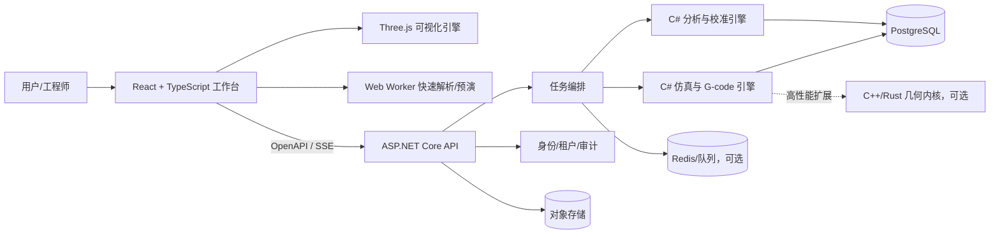

# FORGE·X Insight 优化开发手册

**副标题：React + TypeScript 前端重构与 C# 工业计算平台演进方案**

**文档版本：** V1.0

**基线版本：** FORGE·X Insight 0.19.0

**编制日期：** 2026-08-10
**适用仓库：** `E:\Projects\3dprint`

> 本手册是后续研发、拆分任务、代码评审、验收和回滚的统一依据。核心原则是：**保留已经验证的业务资产，渐进替换技术载体；React + TypeScript 负责交互与可视化，C# 负责权威计算、业务规则和工业数据闭环。**

---

## 1. 升级结论

### 1.1 最终技术决策

本项目建议升级为“Web 工业软件”混合架构，而不是把全部代码机械翻译成 C#：

| 层级 | 推荐技术 | 核心职责 |
| --- | --- | --- |
| 前端应用层 | React + TypeScript + Vite | 页面、交互、状态、任务工作台、报表和权限界面 |
| 可视化与轻量预演层 | TypeScript + Three.js + Web Worker | 3D 场景、逐层路径、动画回放、客户端快速预览 |
| 权威计算与业务层 | ASP.NET Core（.NET 10 LTS） | 仿真、G-code 分析、统计、校准、任务、租户、审计和 API |
| 数据层 | PostgreSQL + 对象存储 + Redis（按规模启用） | 结构化任务、日志/G-code、缓存、队列和版本化结果 |
| 高性能几何内核（后续） | C++/Rust，可选 | 网格修复、布尔运算、复杂切片等高性能算法 |

这不是“JavaScript 不专业、C# 才专业”的替换关系，而是按职责选择运行环境：

- React/TypeScript 更适合复杂 Web UI、组件化、类型约束和浏览器生态；
- C# 更适合长期运行服务、强类型领域模型、并发任务、数据库、权限、审计和可测试计算内核；
- Three.js 继续承担 GPU 可视化；不把每帧渲染通过网络交给 C#；
- 模拟结果以 C# 服务端为权威，浏览器预览仅用于即时反馈，二者通过黄金样例保持一致。

### 1.2 预期结果

完成本手册全部阶段后，项目应具备：

1. React + TypeScript 统一前端工程、路由、组件、状态和错误边界；
2. C# 权威仿真与分析服务，输出可追溯、可复现、带版本的计算结果；
3. G-code、真机日志、任务、校准样本和分析结论统一持久化；
4. 单一身份模型同时支持 API Key 与 Partner SSO，并按租户隔离数据；
5. 大文件解析进入 Worker 或后台任务，页面不再因 64 MB G-code 阻塞；
6. OpenAPI 契约生成 TypeScript 客户端，减少前后端字段漂移；
7. 单元、契约、黄金样例、端到端、性能与安全测试进入同一发布门禁；
8. 任一迁移阶段可通过功能开关切回旧实现，避免“大爆炸式重写”。

---

## 2. 当前实现基线

### 2.1 已实现能力

当前 0.19.0 已经不是纯演示页面，主要资产包括：

- FDM 参数配置、内置参数模型、图片建模和路径生成；
- Three.js 3D 场景、2D/3D 逐层查看和路径回放；
- G-code 导入、解析、估时、耗材与层信息统计；
- 真机日志导入及计划值/计算值/实测值对比；
- 机器 Profile、时间校准包、校准发布与审核相关能力；
- 生产任务 CSV 数据分析、图表、证据和报告；
- Node.js 服务端任务、SSE、分享、数据源、知识库和 AI/规则分析；
- Partner SSO 的基础实现；
- 约 764 条显式测试通过，lint、format 和演示包检查通过。

这些属于应迁移和复用的业务资产，而不是应被整体废弃的代码。

### 2.2 当前技术形态

| 项目 | 当前状态 | 主要影响 |
| --- | --- | --- |
| 前端 | 约 25 个经典脚本，约 1.07 万行 JavaScript | 全局对象和跨文件调用较多，改动影响面难判断 |
| UI 框架 | 无 React/Vue 等框架 | 页面状态、生命周期、错误边界和组件复用依赖人工约定 |
| 类型系统 | JavaScript | DTO、单位、可空值和任务状态易发生运行期错误 |
| 3D | Three.js r152 | 已形成可复用渲染资产，但需从全局脚本中解耦 |
| 后端 | Node.js，约 0.33 万行 | 已能提供 API，但认证、租户、指标和数据治理需增强 |
| 构建 | 前端零构建 | 部署简单，但缺少类型检查、模块分包和工程边界 |
| 数据 | 文件/内存混合 | 重启、容器权限、租户隔离和历史数据治理存在风险 |

### 2.3 已确认的优先问题

#### P0：迁移开始前必须处理

1. **认证策略冲突**：开启 `REQUIRE_AUTH=1` 时，分析接口先执行 API Key 守卫，再识别 SSO 会话，有效 SSO 用户仍会收到 401。
2. **租户隔离不完整**：知识上传、任务结果/SSE、分享等接口未统一校验 owner/tenant，存在跨用户读取或污染风险。
3. **G-code 与日志绑定未真正验证**：运行时仅保留 `gcodeSha256` 字段，没有对导入 G-code 重新计算并核对摘要。
4. **Delta 原点接线错误**：机型标记使用 `Delta`，UI 判断使用 `delta`，导致中心原点逻辑未实际命中。
5. **SSO 能力误报**：无全局 AI Key、但用户 SSO Key 有效时，`/healthz` 仍报告规则引擎，前端会隐藏可用能力。
6. **缓存链路失效**：前端每次提问重新上传数据源并获得随机 ID，而缓存键包含该 ID，相同数据/问题难以命中缓存。

#### P1：第一轮架构升级处理

1. `/metrics` 的失败、降级、缓存和时长指标只有字段，没有完整更新逻辑；
2. 知识库已落盘并被分析消费，但前后端文案仍描述为“内存态”；
3. SSE 出错后前端直接转本地分析，未重连或轮询服务端仍在运行的任务；
4. 分享撤销 API 已存在，UI 丢弃 `revokeKey`，用户无法正常撤销；
5. 浏览器 `file://` 直开时，认证初始化产生无效 `/api/auth` 请求和控制台错误；
6. 仿真、日志、分析和校准尚未进入统一历史任务库；
7. G-code 大文件仍在主线程一次性 `split`，容易卡住 UI；
8. 容器数据目录的创建、权限和持久化未形成可验证发布门禁。

#### P2：产品和文档治理

- “模型导入”与实际 STL/OBJ/3MF 输入能力不一致；
- 开发文档中的 Three.js 版本、Fastify、PDF/Excel/样例文件等说明已经漂移；
- 当前工作区存在未提交改动和未跟踪 SSO 文件，不适合作为正式迁移基线；
- `server/services/analysis.js` 含真实 NUL 字节，影响 Git diff 与审查。

---

## 3. 目标架构

### 3.1 逻辑架构



### 3.2 前后端职责边界

| 功能 | React/TypeScript | C# 服务端 |
| --- | --- | --- |
| 页面与工作区布局 | 主责 | 不参与 |
| 表单校验与即时提示 | 主责 | 再校验并给出领域错误 |
| 3D 相机、材质、选中、逐层动画 | 主责 | 输出可视化数据，不逐帧控制 |
| 快速参数预览 | 可做近似计算 | 产出最终权威结果 |
| G-code 大文件解析 | Worker 可做本地预览 | 后台任务做权威解析与摘要校验 |
| 估时、耗材、风险评分 | 显示及对比 | 主责，记录算法版本和输入摘要 |
| 统计、置信区间、校准训练 | 仅展示 | 主责 |
| 用户、租户、权限、配额 | 展示登录态 | 主责 |
| 任务、SSE、重试、幂等 | 状态订阅 | 主责 |
| 数据持久化、审计、分享撤销 | 发起操作 | 主责 |

### 3.3 权威结果原则

所有可用于报告、排产、校准和审计的结果必须由 C# 引擎生成，至少带有：

- `jobId`、`tenantId`、`createdAt`；
- `inputSha256`、`profileVersion`、`engineVersion`；
- 单位明确的输入与输出；
- 状态：`queued/running/succeeded/degraded/failed/cancelled`；
- 警告、降级原因和计算耗时；
- 可重放所需的输入引用和随机种子（如算法使用随机过程）。

浏览器本地预演结果必须显示“预览”标识，不直接写入正式校准样本。只有权威结果可以进入生产分析和校准训练集。

---

## 4. 目标仓库结构

```text
3dprint/
├─ frontend/
│  ├─ src/
│  │  ├─ app/                 # 启动、路由、Provider、错误边界
│  │  ├─ components/          # 无业务依赖的通用组件
│  │  ├─ features/
│  │  │  ├─ simulator/        # 参数、运行、结果
│  │  │  ├─ viewer/           # 2D/3D、逐层、回放
│  │  │  ├─ gcode/            # 导入、摘要、路径统计
│  │  │  ├─ machine-logs/     # 真机日志和对账
│  │  │  ├─ analytics/        # 生产分析与报告
│  │  │  ├─ calibration/      # 样本、训练、审核、发布
│  │  │  └─ administration/   # 身份、租户、配额、审计
│  │  ├─ engine/              # Three.js 适配器和纯 TS 轻量计算
│  │  ├─ workers/             # G-code/CSV/几何解析 Worker
│  │  ├─ api/                 # OpenAPI 生成客户端与 SSE 封装
│  │  ├─ stores/              # 跨页面客户端状态
│  │  ├─ types/               # UI 专用类型，不复制服务端 DTO
│  │  └─ styles/              # tokens、全局样式和主题
│  ├─ tests/
│  ├─ package.json
│  ├─ tsconfig.json
│  └─ vite.config.ts
├─ backend/
│  ├─ ForgeX.Api/             # HTTP、SSE、认证、OpenAPI
│  ├─ ForgeX.Application/     # 用例、命令、查询、编排
│  ├─ ForgeX.Domain/          # 实体、值对象、领域规则
│  ├─ ForgeX.Simulation/      # 仿真、路径、估时、G-code
│  ├─ ForgeX.Analytics/       # 统计、校准、证据生成
│  ├─ ForgeX.Infrastructure/  # EF Core、文件、缓存、队列、AI
│  └─ ForgeX.Contracts/       # API DTO 与事件契约
├─ tests/
│  ├─ contract/               # OpenAPI/DTO 兼容性
│  ├─ golden/                 # JS 与 C# 黄金样例对比
│  ├─ e2e/                    # Playwright 用户流程
│  ├─ performance/            # 大文件和并发基准
│  └─ fixtures/               # 版本化 G-code、日志、CSV、Profile
├─ deploy/
│  ├─ docker/
│  └─ observability/
└─ doc/
```

命名说明：示例使用 `ForgeX.*` 作为程序集名；创建解决方案时可按最终产品名称统一调整，但领域边界不要合并回一个大项目。

---

## 5. React + TypeScript 前端重构规范

### 5.1 推荐基础栈

| 类别 | 推荐 | 约束 |
| --- | --- | --- |
| UI | React + TypeScript | 新代码一律 TS/TSX，启用 `strict` |
| 构建 | Vite | 生产输出使用相对资源基址，保留静态部署能力 |
| 路由 | React Router | 页面级懒加载；嵌入模式可使用内存路由 |
| 服务端状态 | Query 缓存库或统一自研层 | 请求、缓存、失效、重试集中管理，不散落在组件中 |
| 客户端状态 | 小型集中 Store | 只存 UI/会话态；服务端数据不重复复制 |
| 表单与契约校验 | Schema 校验库 | 上传、Profile、参数和 API 响应在边界校验 |
| 测试 | Vitest + Testing Library + Playwright | 组件行为优先，避免只测内部实现 |
| 3D | Three.js | 保留，封装为独立引擎对象，不直接成为 React state |

第三方包不在本手册锁死具体小版本。首次实施时统一选择当前稳定版本并写入 lockfile；升级依赖必须通过类型检查、单测、黄金样例和 E2E。

### 5.2 TypeScript 编译约束

建议开启：

```json
{
  "compilerOptions": {
    "strict": true,
    "noUncheckedIndexedAccess": true,
    "exactOptionalPropertyTypes": true,
    "noImplicitOverride": true,
    "useUnknownInCatchVariables": true,
    "verbatimModuleSyntax": true
  }
}
```

工程规则：

- 新代码不使用隐式 `any`；外部输入先作为 `unknown` 校验；
- 长度、时间、温度、质量、成本不使用含义不明的裸字段名；例如 `durationSeconds`、`temperatureCelsius`；
- 枚举状态使用判别联合，`switch` 必须穷尽；
- API DTO 由 OpenAPI 生成，禁止手写一份“差不多”的重复接口；
- 组件不直接拼 URL、不直接读写 `localStorage`、不直接访问全局 `window.FX*`；
- 文件解析、网络访问、存储、Three.js 均通过适配器注入。

### 5.3 React 组件边界

推荐拆分：

```text
SimulatorPage
├─ SimulationToolbar
├─ ModelInputPanel
├─ ProcessParameterForm
├─ ViewerWorkspace
│  ├─ ThreeViewport
│  ├─ LayerTimeline
│  └─ ToolpathLegend
├─ RunStatusPanel
└─ SimulationResultPanel
   ├─ SummaryCards
   ├─ RiskFindings
   └─ EvidenceDrawer
```

组件应遵循：

1. 页面组件负责组合，不包含复杂算法；
2. Feature 内的业务 Hook 负责用例调用，例如 `useRunSimulation`；
3. API、Worker、Three.js 对象由 service/engine 管理；
4. 派生值优先通过纯函数计算，不为每个派生值创建 state；
5. 可视化帧循环不触发 React 高频重渲染；
6. 所有异步页面具备 loading、empty、degraded、error、success 状态；
7. 顶层设置错误边界，单个图表或 3D 视口故障不拖垮整个工作台。

### 5.4 Three.js 与 React 的正确分工

Three.js 不需要迁移成 C#，也不要把场景树全部塞进 React state。建议：

```ts
export interface ViewerEngine {
  attach(canvas: HTMLCanvasElement): void;
  loadToolpath(data: ToolpathViewModel): Promise<void>;
  setLayer(layer: number): void;
  setPlayback(state: PlaybackState): void;
  resize(width: number, height: number, dpr: number): void;
  dispose(): void;
}
```

React 组件只负责：

- 创建并提供 canvas；
- 把稳定的 view model 传给引擎；
- 处理工具栏、选中状态和可访问性；
- 在卸载时调用 `dispose()`，释放几何体、材质、纹理和事件监听。

### 5.5 Web Worker

以下任务优先移出主线程：

- G-code 分块读取、行解析、层识别和路径压缩；
- 大 CSV 解析与字段画像；
- 图片到高度场的预处理；
- 仅用于即时反馈的轻量路径估算；
- 传给 Three.js 前的顶点缓冲构建。

Worker 必须支持：进度、取消、超时、结构化错误和 Transferable 数据。大文件不得先整体转成字符串再一次性 `split`。

### 5.6 CSS 迁移策略

第一阶段保留现有视觉，不同时进行大规模 UI 改版：

1. 将现有 `css/style.css` 作为 legacy 全局样式接入 React；
2. 提取颜色、间距、圆角、阴影、字号为 CSS variables；
3. 新组件使用 feature-scoped CSS 或 CSS Modules；
4. 每迁完一个页面，删除对应 legacy 选择器；
5. 使用截图回归保护布局，不以“肉眼差不多”为验收标准；
6. 键盘操作、焦点、颜色对比和动态内容提示同时纳入验收。

### 5.7 兼容原有零依赖直开

React + Vite 引入构建后，建议保留两种交付模式：

- **生产模式**：由 ASP.NET Core 或静态服务器托管构建产物；
- **离线演示模式**：Vite 使用相对资源基址，认证和后端功能通过运行模式检测关闭或切换本地适配器。

代码不得在 `file://` 下无条件请求 `/api/auth/*`。启动时先解析 `RuntimeMode`，再装配 `RemoteApiAdapter` 或 `OfflineAdapter`。

---

## 6. C# 承担的核心工作

### 6.1 C# 不是只写“后台管理”

在目标架构中，C# 是工业计算和业务可信度的中心，至少承担：

1. 权威仿真输入校验与任务编排；
2. G-code 流式解析、运动统计、摘要绑定和异常诊断；
3. 估时、耗材、成本与风险模型；
4. 真机日志解析、预测/实测对账和历史任务库；
5. 统计分析、置信区间、显著性、证据生成；
6. 校准样本生成、拟合、候选、审核、发布与回滚；
7. 设备/Profile/固件/材料版本管理；
8. 多租户身份、权限、配额、分享和审计；
9. 文件、数据库、缓存、队列和可观测性；
10. AI Provider 和知识检索的隔离、限额和降级。

### 6.2 建议的领域接口

```csharp
public interface ISimulationEngine
{
    Task<SimulationResult> RunAsync(
        SimulationInput input,
        IProgress<SimulationProgress>? progress,
        CancellationToken cancellationToken);
}

public interface IGCodeAnalyzer
{
    Task<GCodeAnalysisResult> AnalyzeAsync(
        Stream gcode,
        GCodeAnalysisOptions options,
        CancellationToken cancellationToken);
}

public interface IMachineLogReconciler
{
    ReconciliationResult Compare(
        GCodeAnalysisResult planned,
        MachineLogRecord actual);
}

public interface ICalibrationTrainer
{
    Task<CalibrationCandidate> TrainAsync(
        CalibrationDataset dataset,
        CancellationToken cancellationToken);
}
```

接口输入输出必须使用不可变记录或值对象；流式文件不要依赖物理路径；所有长任务支持取消；业务层不直接依赖 HTTP、EF Core 或具体对象存储。

### 6.3 仿真引擎分层

```text
SimulationEngine
├─ InputNormalizer           # 单位、默认值、边界和 Profile 合并
├─ GeometryModel             # 体积、包围盒、高度场/网格引用
├─ LayerPlanner              # 层高与层计划
├─ ToolpathPlanner           # 周界、填充、支撑、空驶
├─ MotionEstimator           # 速度、加速度、回抽、停顿
├─ MaterialEstimator         # 长度、体积、质量
├─ CostEstimator             # 材料、能耗、机时
├─ RiskEvaluator             # 悬垂、温度、送料、路径风险
└─ EvidenceBuilder           # 指标、警告和可追溯证据
```

初期迁移顺序应从“可对照的纯计算”开始：摘要、统计、估时、对账，再迁移更复杂的路径规划。这样更容易用现有 JS 结果建立黄金样例。

### 6.4 单位和数值规范

- 内部统一 SI 或明确的制造业单位，不允许同一字段有时为 mm、有时为 m；
- DTO 名称带单位，或使用强类型值对象；
- 浮点比较使用每项指标单独定义的绝对/相对容差；
- 中间结果不提前四舍五入；展示层负责格式化；
- 金额使用 `decimal`；几何/运动计算通常使用 `double`；
- 输出记录 `engineVersion` 和 `calibrationVersion`；
- 计算顺序、集合排序和序列化尽量保持确定性。

### 6.5 长任务和进度

统一任务模型：

```text
POST /api/v1/simulations        -> 202 + jobId
GET  /api/v1/jobs/{jobId}       -> 当前状态和结果引用
GET  /api/v1/jobs/{jobId}/events -> SSE 进度/心跳/完成
POST /api/v1/jobs/{jobId}/cancel -> 请求取消
```

要求：

- SSE 定期发送 heartbeat；
- 断线后携带最后事件 ID 重连；
- 重连失败时轮询 `GET /jobs/{id}`，不立即在浏览器重复启动同一计算；
- 创建操作支持幂等键，避免网络重试重复计费；
- 状态写数据库，进程重启后可恢复或明确标记失败；
- 结果和错误采用稳定错误码，不以中文文案作为程序判断条件。

---

## 7. API 与数据契约

### 7.1 API 资源规划

| 资源 | 关键接口 | 说明 |
| --- | --- | --- |
| jobs | 创建、查询、事件、取消 | 所有长任务的统一生命周期 |
| simulations | 运行、结果、版本 | 仿真权威结果 |
| gcode | 上传、摘要、解析结果 | 内容寻址，支持分块上传 |
| machine-logs | 上传、解析、对账 | 与 G-code 摘要建立强绑定 |
| production-runs | 列表、详情、标签 | 统一历史任务库 |
| analytics | 提问、报告、证据 | 规则/AI 引擎统一协议 |
| datasources | 上传、版本、删除 | 按内容哈希去重 |
| knowledge | 文档、检索、删除 | 租户级隔离和配额 |
| calibrations | 样本、训练、候选、审核、发布、回滚 | 完整治理闭环 |
| profiles | 机器、固件、材料 | 版本化 Profile |
| shares | 创建、查询、撤销 | owner 可撤销，密钥仅作补充 |
| auth | 会话、API Key、SSO | 统一身份策略 |
| health/metrics | 存活、就绪、能力、指标 | 区分全局能力与当前用户能力 |

### 7.2 内容寻址

G-code、日志、CSV 和知识文档采用 SHA-256 内容摘要：

- 相同内容只保存一份物理对象；
- 数据源缓存键使用内容摘要，不使用随机上传 ID；
- 日志声明的 `gcodeSha256` 必须与实际文件重新计算值一致；
- 对象元数据保存长度、MIME、创建者、租户和扫描状态；
- 业务实体引用对象 ID，不把大文件塞入数据库行。

### 7.3 统一身份与租户

认证顺序应改为统一策略：

1. 解析 SSO session；
2. 解析 API Key；
3. 任一有效身份即可通过需要认证的端点；
4. 映射为统一 `CallerContext`：`userId/tenantId/roles/scopes/providerKey`；
5. 后续授权只依赖 `CallerContext`，不再在每条路由里分别判断来源。

所有数据实体至少包含 `TenantId` 和 `OwnerId`；查询默认附带租户过滤；任务结果、SSE、知识库、数据源、分享和校准均执行相同策略。后台任务必须显式携带租户上下文，避免脱离 HTTP 后丢失隔离条件。

### 7.4 OpenAPI

- C# API 生成 OpenAPI 文档；
- CI 校验 OpenAPI 变更；
- 前端客户端和 DTO 从契约生成；
- 破坏性字段变更必须升级 API 版本或提供兼容期；
- 日期使用 ISO 8601 UTC，枚举和错误码固定；
- 大整数、二进制和流式事件单独定义序列化规则。

---

## 8. 数据与持久化设计

### 8.1 核心实体

| 实体 | 关键字段 |
| --- | --- |
| Tenant | Id、Name、Plan、Quota、CreatedAt |
| User | Id、TenantId、ExternalSubject、Roles |
| StoredObject | Id、TenantId、Sha256、Size、MediaType、StorageKey |
| ProductionRun | Id、TenantId、MachineId、ProfileVersion、Status、StartedAt、FinishedAt |
| SimulationJob | Id、TenantId、InputObjectId、EngineVersion、Status、ResultObjectId |
| GCodeArtifact | Id、ObjectId、Sha256、Dialect、LayerCount、DeclaredMetrics |
| MachineLog | Id、ObjectId、GCodeSha256、Firmware、ActualMetrics |
| Reconciliation | Id、RunId、Planned、Calculated、Actual、Deltas |
| CalibrationSample | Id、TenantId、RunId、MachineModel、Firmware、Material |
| CalibrationRelease | Id、Version、Status、Metrics、ApprovedBy、PublishedAt |
| Datasource | Id、TenantId、ContentSha256、Schema、RowCount |
| AnalysisReport | Id、TenantId、DatasourceId、Engine、QuestionHash、Evidence |
| KnowledgeDocument | Id、TenantId、ObjectId、IndexVersion、Status |
| AuditEvent | Id、TenantId、Actor、Action、Target、Before、After、CreatedAt |

### 8.2 数据保留

- 原始文件、解析结果、业务任务和分析报告分别配置保留期；
- 删除采用先逻辑删除、后异步清理对象；
- 校准发布使用不可变版本，回滚仅切换 active version；
- 审计记录不可由普通用户修改；
- 租户删除必须生成清理报告；
- 备份必须进行恢复演练，不以“成功生成备份文件”代替恢复验证。

### 8.3 对象存储与数据库一致性

上传流程建议：临时对象 → 摘要/类型/安全检查 → 数据库提交 → 正式对象标记。失败任务由清理作业删除孤儿对象。下载使用短时授权 URL 或后端流式代理，不暴露其他租户的存储键。

---

## 9. 渐进迁移路线

### 9.1 总原则

- 先冻结行为，再替换实现；
- 先修 P0，再搭新骨架；
- 先迁边界清晰的页面和纯计算；
- 新旧实现双跑，对比通过后才切主；
- 每阶段有功能开关、数据迁移脚本和回滚步骤；
- 不在同一阶段同时重构 UI、算法和数据模型。

### 9.2 阶段 0：建立可迁移基线（1～2 周）

**工作项**

1. 整理当前未提交文件，形成可追溯基线标签；
2. 修复 SSO/API Key 统一认证顺序；
3. 为知识、任务、SSE、分享增加 tenant/owner 校验；
4. 补运行时 G-code SHA-256 核对；
5. 修复 Delta 大小写接线；
6. 修复 `file://` 认证启动错误；
7. 数据源按内容摘要去重，修复缓存键；
8. 补 metrics 的真实计数和时长；
9. 把 NUL 字节改为源码转义；
10. 将关键现有输出固化为黄金样例。

**退出门槛**

- 全量 `npm test`、lint、format、Chromium E2E 通过；
- SSO-only、API-key-only、双身份三种模式均有集成测试；
- 非 owner 访问任务/知识/分享均被拒绝并留审计；
- 已生成可复现基线镜像或发布包。

**回滚**：此阶段只做缺陷修复，以基线标签和数据库备份回滚。

### 9.3 阶段 1：React + TypeScript 骨架（1～2 周）

**工作项**

- 建立 `frontend/`、Vite、TypeScript strict、lint、unit test；
- 建立 App Shell、路由、Error Boundary、RuntimeMode；
- 接入现有 CSS variables 和基础布局；
- 建立 API Client/SSE/Worker/Three.js 适配器接口；
- 构建产物由现有 Node 服务暂时托管；
- CI 增加 typecheck、build 和组件测试。

**退出门槛**

- 新首页可在服务器和 `file://` 演示模式启动；
- 无控制台错误；
- 旧页面仍可通过功能开关访问；
- `npm run build` 产物可部署且资源路径正确。

**回滚**：入口文件切回原 `index.html`。

### 9.4 阶段 2：迁移前端功能（3～5 周）

推荐顺序：

1. Header、导航、通知、身份状态；
2. 参数表单和 Profile 选择；
3. Three.js 视口与逐层回放；
4. G-code/日志导入和对账；
5. 数据分析、图表和报告；
6. 校准、分享、管理界面。

每迁一个 feature，执行：

- 旧行为清单 → 新组件 → 单元/组件测试 → 截图回归 → E2E → 删除对应全局入口；
- 旧 JS 算法暂时通过 Adapter 调用，不在 UI 迁移阶段同步重写；
- 迁完后禁止新代码继续写入 `window.FX*`。

**退出门槛**：主用户流程全部进入 React；旧 DOM 事件绑定不再控制新页面；Three.js 资源释放测试通过。

### 9.5 阶段 3：建立 C# 平台底座（2～3 周）

**工作项**

- 创建 .NET 10 LTS solution 与六层项目；
- 建立 OpenAPI、统一错误、日志、trace、health/readiness；
- 建立身份、租户、PostgreSQL、对象存储和任务模型；
- 先迁移数据源、知识、分享、任务和校准治理 API；
- React 切换到生成的 TypeScript Client；
- Node API 保留为兼容代理或功能开关备用。

**退出门槛**

- API 契约测试通过；
- 租户隔离集成测试通过；
- 容器以非 root 用户运行且数据目录可写；
- 备份/恢复、结构化日志和 metrics 实测通过。

**回滚**：网关或环境变量把 API 流量切回 Node；数据库变更使用向后兼容迁移。

### 9.6 阶段 4：迁移分析与校准（2～4 周）

迁移内容：CSV 数据画像、统计指标、置信区间、证据、规则分析、校准拟合、候选评估和发布治理。

**双跑标准**

- 同一 fixture 同时进入 JS 与 C#；
- 分类、样本量、过滤条件必须完全一致；
- 浮点指标按预设容差比较；
- 差异报告进入 CI artifact；
- 人工批准差异必须记录原因和新基线版本。

**退出门槛**：C# 结果成为默认，JS 保留一版发布周期作为回退。

### 9.7 阶段 5：迁移 G-code 与仿真核心（4～8 周）

推荐顺序：

1. 流式词法/行解析；
2. 坐标模式、挤出模式、单位、温度和层事件；
3. 路径统计与摘要；
4. 运动和时间估算；
5. 材料、成本与风险；
6. 层计划和工具路径算法；
7. 供前端 Three.js 使用的压缩可视化数据。

> **实施记录（2026-08-11 / Stage 5-D）**：上述 1–7 已形成 C# 权威闭环。材料 Profile 的价格、喷嘴温区、床温下限、最大打印速度与最大体积流量进入 v2 指纹；引擎 1.4.0 输出耗材直接成本及有界分级风险，React 的 `dotnet` 模式原子切换该结果，`shadow` 仍只对照，`browser` 保持零请求回滚。当前成本只包含直接耗材成本；能耗与机时成本留待取得可审计的设备功率和费率输入后扩展。

对大型文件进行基准：峰值内存、首个进度时间、总耗时、取消延迟和结果大小。出现几何性能瓶颈后，再对具体热点引入 native 内核；不预先把整套系统改成 C++。

**退出门槛**

- 黄金样例、真实样例和畸形输入均通过；
- 权威结果带 input/profile/engine 摘要；
- 大文件解析不阻塞浏览器；
- JS/C# 对比差异在已批准容差内；
- 旧仿真路径经过一个稳定发布周期后再删除。

### 9.8 阶段 6：生产强化（2～3 周）

- 队列、重试、死信、任务恢复和配额；
- 性能压测和容量计划；
- 安全扫描、依赖治理、密钥轮换；
- SLO、告警和运行手册；
- 数据恢复演练和版本回滚演练；
- 更新 README、开发文档、部署文档和 Changelog。

### 9.9 粗略周期

| 团队配置 | 可用版本 | 完整迁移 |
| --- | --- | --- |
| 1 名全栈开发 | 8～12 周完成 React 主流程与 C# 底座 | 16～24 周 |
| 2～3 人小团队 | 5～8 周完成 React 主流程与 C# 底座 | 10～16 周 |

周期取决于真实 G-code/日志样本数量、是否实现 STL/3MF 导入、算法一致性要求和部署环境。估期应在阶段 0 获取基准后重新校准。

---

## 10. 测试与质量门禁

### 10.1 测试金字塔

| 层级 | 覆盖内容 | 工具/方式 |
| --- | --- | --- |
| 纯函数单测 | 单位、参数、解析、统计、校准 | Vitest / xUnit |
| 组件测试 | 表单、状态、错误、可访问性 | Testing Library |
| 契约测试 | OpenAPI、错误码、SSE 事件 | 生成客户端 + API 测试 |
| 黄金样例 | JS/C# 结果对比 | 版本化 fixtures + diff 报告 |
| 集成测试 | DB、对象存储、认证、租户、队列 | Testcontainers 或隔离环境 |
| E2E | 导入→仿真→分析→分享/撤销 | Playwright |
| 性能测试 | 大 G-code、并发任务、Worker、API | 基准与压力测试 |
| 安全测试 | 越权、上传、配额、SSO、Key | 自动化用例 + 审计 |

### 10.2 黄金样例要求

每个 fixture 包含：

- 原始输入及 SHA-256；
- 机器/Profile/材料/固件版本；
- 期望层数、路径长度、挤出量、耗材、时间和警告；
- 指标容差；
- 基线引擎版本和批准人；
- 更新原因。

禁止在测试失败时无解释地覆盖 expected 文件。

### 10.3 合并门禁

每个 PR 必须通过：

```text
frontend: install --frozen -> lint -> typecheck -> unit -> build
backend:  restore locked    -> format -> build -> unit -> integration
shared:   contract -> golden -> selected e2e -> security checks
```

主分支夜间任务再执行全浏览器 E2E、性能、容器、恢复演练和完整大文件样例。

### 10.4 性能预算

阶段 0 先记录现状，再以相对预算约束回归：

- 常用页面交互不比基线慢 10% 以上；
- 64 MB G-code 解析过程中主线程长任务显著下降，UI 可响应；
- 同一数据/问题二次分析应命中缓存，避免重复 AI 调用；
- SSE 断线不创建重复任务；
- C# 服务记录 P50/P95/P99 时长、失败率、降级率和缓存命中率；
- 内存峰值、对象大小和并发数纳入发布报告。

绝对阈值应以目标设备和部署规格实测确定，不用开发机上的单次结果代替生产容量结论。

---

## 11. 安全、权限与审计

### 11.1 必做项

- API Key 或有效 SSO session 统一认证；
- 资源级授权，不只检查“是否登录”；
- 所有查询带 tenant，owner/scopes 决定读写；
- 上传限制扩展名、MIME、大小、解压后大小、行数和解析时限；
- 知识库与数据源配额、删除、隔离和提示词污染防护；
- 分享链接有过期、撤销、访问次数和审计；
- AI Provider Key 只在服务端使用并按用户/租户隔离；
- 日志不记录 API Key、会话 Cookie、文件正文和敏感提示词；
- 错误响应不返回内部路径和堆栈；
- 管理操作、校准发布和数据删除写审计事件。

### 11.2 授权测试矩阵

至少覆盖：匿名、有效 API Key、有效 SSO、双身份、过期会话、错误租户、非 owner、管理员。针对任务状态、SSE、结果、知识、数据源、分享、校准和审计逐项验证读/写/删权限。

---

## 12. 可观测性与运行

### 12.1 指标

至少提供：

- HTTP 请求量、状态码和时长；
- 任务 queued/running/succeeded/degraded/failed/cancelled；
- 仿真、G-code、分析、校准各自时长；
- 缓存命中、重复上传去重率、AI 调用次数和成本；
- SSE 连接、重连、轮询兜底；
- 文件大小、解析错误类型和超时；
- 队列深度、重试和死信；
- 数据库/对象存储依赖健康。

指标更新必须由实际代码路径驱动，并有测试验证值发生变化，不只验证字段存在。

### 12.2 日志与追踪

结构化日志统一携带 `traceId/jobId/tenantId/userId`（敏感字段脱敏）。前端错误上报包含版本、路由、feature 和 traceId。一个仿真任务从 React 请求、C# API、队列、引擎到存储应能通过 trace 关联。

### 12.3 健康检查

- `/health/live`：进程存活，不访问昂贵依赖；
- `/health/ready`：数据库、对象存储、任务系统是否可接流量；
- `/api/v1/capabilities`：区分系统能力和当前用户能力；
- 不再用一个全局 provider 状态推断 SSO 用户的可用能力。

---

## 13. 部署与回滚

### 13.1 推荐部署单元

```text
reverse-proxy
├─ /                -> React 静态资源
├─ /api/*           -> ASP.NET Core API
└─ /legacy-api/*    -> Node 兼容服务（迁移期）

dependencies
├─ PostgreSQL
├─ Object Storage
└─ Redis/Queue（达到并发需求时启用）
```

ASP.NET Core 也可直接托管 React build，以简化单机交付；生产仍建议通过反向代理统一 TLS、压缩、缓存和请求限制。

### 13.2 容器要求

- 镜像多阶段构建；
- 以非 root 用户运行；
- 启动前创建并验证数据目录权限；
- 数据不写入镜像层；
- 配置来自环境变量/密钥系统；
- 健康检查区分 live/ready；
- 镜像构建和启动进入 CI；
- 在临时环境跑上传、持久化、重启、恢复和下载实测。

### 13.3 回滚策略

1. 前端静态资源带版本并可切上一版本；
2. React feature 有开关，能退回 legacy 页面；
3. C# API 迁移期保持向后兼容，Node 可作为回退；
4. 数据库采用 expand → migrate → contract，回滚窗口内不先删旧列；
5. 校准发布只切 active version，不覆盖历史版本；
6. 引擎结果记录版本，回滚后仍可解释旧结果；
7. 发布前执行回滚演练并记录命令、输入、输出和退出状态。

---

## 14. 编码规范

### 14.1 TypeScript/React

- Feature 优先组织代码，避免按 `components/hooks/utils` 形成跨业务大杂烩；
- 组件尽量纯，副作用放在 Hook/service；
- Hook 名称表达业务动作，不用大量通用 `useData`；
- 网络请求支持 AbortSignal；
- 不在 render 中启动异步任务；
- 使用稳定 key，不用数组下标表示可变业务行；
- Three.js 和 Worker 必须实现 dispose/terminate；
- UI 文案集中管理，错误码映射到可读信息；
- 无障碍名称、键盘操作和焦点恢复属于功能验收。

### 14.2 C#/.NET

- `Nullable` 和警告提升为错误；
- API、Application、Domain、Infrastructure 依赖方向单向；
- 领域层无 EF/HTTP/文件系统依赖；
- 异步方法传递 `CancellationToken`；
- 禁止同步阻塞异步任务；
- 不使用全局可变静态状态；
- 领域错误使用稳定 code，不以异常控制常规分支；
- 计算服务尽量无状态，方便并行和测试；
- 数据库更新有并发控制和幂等策略；
- 公共 API 和核心算法写 XML 文档及关键公式来源。

### 14.3 Git 与评审

- 一个 PR 解决一个可验收主题；
- 大重构先提交纯移动，再提交行为变化；
- 生成代码单独目录，不和手写代码混合；
- 算法 PR 附黄金样例差异和性能数据；
- 数据迁移 PR 附前滚/回滚步骤；
- UI PR 附关键视口截图和键盘验证；
- 合并前保持工作区干净，更新 Changelog 和相关文档。

---

## 15. 首个 30 天实施清单

### 第 1 周：冻结与修 P0

- [ ] 建立迁移基线分支/标签和变更清单；
- [ ] 统一 SSO/API Key 认证；
- [ ] 为任务、SSE、知识、分享补 tenant/owner；
- [ ] 修复 SHA-256、Delta 和 `file://` 启动问题；
- [ ] 修复 datasource 去重/缓存；
- [ ] 固化 20～30 组代表性黄金样例。

### 第 2 周：React 工程骨架

- [ ] 建立 `frontend/`、Vite、strict TS；
- [ ] 建立 App Shell、RuntimeMode、ErrorBoundary；
- [ ] 建立 API/SSE/Worker/Viewer 接口；
- [ ] 接入 CSS tokens 和现有主布局；
- [ ] CI 增加 typecheck/build/unit。

### 第 3 周：迁第一个垂直切片

选择“G-code 导入 → 解析进度 → 摘要 → 3D 路径显示”作为第一个垂直切片：

- [ ] React 上传和进度组件；
- [ ] Worker 流式/分块解析适配；
- [ ] Three.js ViewerEngine 封装；
- [ ] 摘要与现有结果黄金对比；
- [ ] 旧/新入口 feature flag；
- [ ] 组件、E2E、内存和取消测试。

### 第 4 周：C# 底座原型

- [ ] 建 solution 与分层项目；
- [ ] 实现 `/health`、OpenAPI、统一错误和 trace；
- [ ] 实现 `IGCodeAnalyzer` 的最小流式解析；
- [ ] React 通过生成客户端调用 C#；
- [ ] JS/C# 双跑并生成差异报告；
- [ ] 建第一份容器化和回滚记录。

### 30 天验收成果

到第 30 天应看到真实成果，而不仅是目录重组：

1. 一个可运行的 React + TypeScript 页面；
2. 一个可运行的 C# API 与 G-code 最小权威解析；
3. 一个新旧双跑的垂直用户流程；
4. 一套自动生成的差异报告；
5. 一次可验证的旧入口回滚；
6. P0 安全与接线问题有测试保护。

---

## 16. Definition of Done

### 16.1 React Feature 完成标准

- [ ] 业务行为与基线一致或差异已批准；
- [ ] TypeScript strict 无错误；
- [ ] loading/empty/degraded/error/success 完整；
- [ ] 组件测试与关键 E2E 通过；
- [ ] 键盘、焦点、可访问名称通过；
- [ ] 无新增全局变量；
- [ ] Worker/Three.js 资源可释放；
- [ ] 截图回归通过；
- [ ] feature flag 和回滚验证通过；
- [ ] 文档和 Changelog 已更新。

### 16.2 C# 计算模块完成标准

- [ ] 输入、输出、单位、错误码和版本明确；
- [ ] 纯计算单测和边界测试通过；
- [ ] 黄金样例在容差内；
- [ ] 支持取消、进度和超时；
- [ ] 记录 trace、指标和算法版本；
- [ ] 租户和权限测试通过；
- [ ] 性能不低于批准基线；
- [ ] 数据迁移和回滚实际执行；
- [ ] OpenAPI 和 TS Client 已更新；
- [ ] 旧实现的下线条件已经满足。

### 16.3 发布完成标准

- [ ] 前端 build、后端 publish、容器 build 均成功；
- [ ] 单元、契约、黄金、E2E、安全和必要性能测试通过；
- [ ] 部署后 live/ready/capabilities/metrics 实测；
- [ ] 上传、仿真、分析、分享、撤销、重启持久化实测；
- [ ] 告警、备份和恢复演练通过；
- [ ] 回滚命令和结果被记录；
- [ ] 发布说明列明算法、契约、数据库和兼容性变化。

---

## 17. 当前文件到目标模块的映射

| 当前文件/区域 | 目标位置 | 处理策略 |
| --- | --- | --- |
| `index.html` | `frontend/src/app` | 先做 React mount，最终成为 Vite HTML 入口 |
| `js/ui.js` | `features/*` + `app` | 按业务流程拆页面、Hook 和组件，禁止整体复制 |
| `js/simulator.js` | `engine/preview` + `ForgeX.Simulation` | 先保留预览，再由 C# 权威实现替换 |
| `js/gcode-parser.js` | `workers/gcode` + `ForgeX.Simulation/GCode` | Worker 负责预览，C# 负责权威流式解析 |
| `js/machine-log.js` | `features/machine-logs` + C# reconciler | 补摘要验证并持久化对账 |
| `js/insight.js` | `features/analytics` | 拆数据源、任务、报告和分享状态 |
| `js/insight-data.js` | C# jobs/repositories | 浏览器 Store 只保留临时 UI 状态 |
| `js/calibration-registry.js` | `ForgeX.Analytics/Calibration` | 迁训练、候选、审核、发布和回滚 |
| `js/api-client.js` | `frontend/src/api/generated` | 由 OpenAPI 生成客户端替代 |
| `js/auth.js` | `app/auth` + C# auth | RuntimeMode 后再初始化；统一身份协议 |
| `server/routes/*` | `ForgeX.Api` endpoints | 逐资源迁移，迁移期保留代理 |
| `server/services/analysis.js` | `ForgeX.Analytics`/Infrastructure | 分离规则、AI provider、缓存和知识检索 |
| `server/services/knowledge.js` | Infrastructure + tenant repository | 落盘能力保留，补租户、配额、删除和文案 |
| `css/style.css` | `styles/tokens.css` + feature CSS | 先兼容，后按页面删除 legacy 样式 |
| `tests/*.js` | `tests/golden` + 前后端测试 | 先作为行为基线，再逐项迁移 |

---

## 18. 关键决策记录

| 决策 | 选择 | 原因 |
| --- | --- | --- |
| 前端框架 | React + TypeScript | 适合复杂交互、组件化、类型约束和团队扩展 |
| 3D 渲染 | 保留 Three.js | 浏览器 GPU 可视化成熟，迁到服务端没有收益 |
| 权威计算 | C#/.NET | 强类型、并发、服务治理、测试和长期维护更匹配 |
| 迁移方式 | 渐进式替换 | 降低停摆和结果漂移风险，支持逐步回滚 |
| API 契约 | OpenAPI 生成 TS Client | 避免 DTO 手工复制和字段漂移 |
| 大文件 | Worker 预览 + C# 后台权威解析 | 同时保证交互响应和可信结果 |
| 数据标识 | 内容 SHA-256 + 业务 ID | 支持去重、缓存、绑定和审计 |
| 校准发布 | 不可变版本 + 审核 + 回滚 | 满足工业数据治理和结果可解释性 |
| Native 内核 | 按热点后置引入 | 避免过早复杂化，只解决实测瓶颈 |

---

## 19. 实施注意事项

1. **React 重构不等于重新设计 UI。** 第一轮先保证功能和行为一致，再做视觉升级。
2. **C# 重构不等于逐行翻译。** 先定义输入、输出、单位、错误和测试，再重写为领域模块。
3. **Three.js 仍是核心资产。** 重点是封装生命周期和数据接口，不是更换渲染引擎。
4. **先打通历史任务库。** 没有统一的 G-code、日志、实测和校准样本，所谓持续学习闭环仍不完整。
5. **先验证安全边界。** SSO、API Key、tenant、owner、知识库和分享应在迁移前形成自动化测试。
6. **结果一致性优先于语言选择。** 每次替换算法，都要用同一输入对比，不以“C# 编译通过”作为计算正确的证明。
7. **发布能力要实跑。** 配置文件、Dockerfile 和 CI 脚本存在，不等同于镜像、持久化和线上流程已经验证。

---

## 20. 参考资料

- React 官方文档：在现有项目中渐进添加 React，https://react.dev/learn/add-react-to-an-existing-project
- Vite 官方文档：静态资源基址配置，https://vite.dev/config/shared-options.html#base
- .NET 官方支持策略：LTS/STS 生命周期，https://dotnet.microsoft.com/platform/support/policy
- ASP.NET Core 官方文档：Web API、OpenAPI、身份与可观测性，https://learn.microsoft.com/aspnet/core/
- Three.js 官方文档：https://threejs.org/docs/

---

**文档结束**
